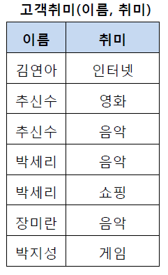
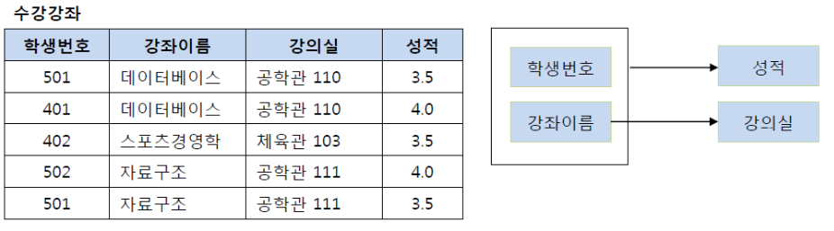
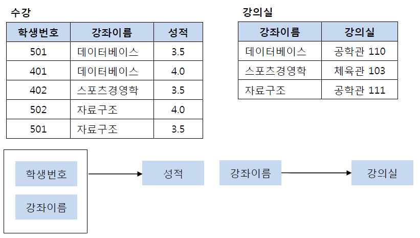
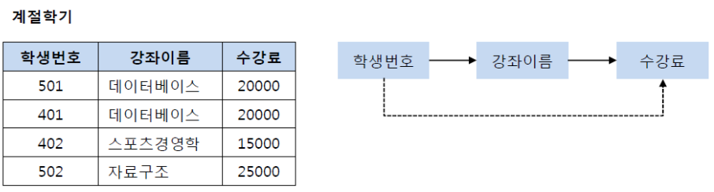
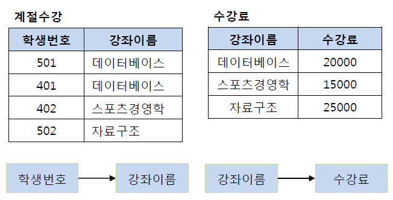
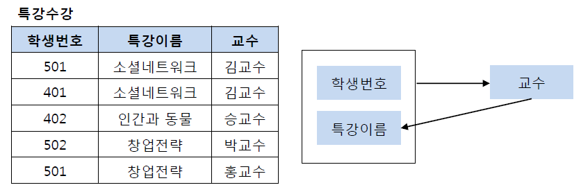

jihyeon-yu

# 4.2 ERD와 정규화 과정

## 정규화(Normalization)

- 정규화(Normalization)의 기본 목표는 테이블 간에 중복된 데이타를 허용하지 않는다는 것
- 무결성(Integrity)를 유지할 수 있으며, DB의 저장 용량 역시 줄일 수 있음

(무결성: 신뢰할 수 있는 서비스 제공을 위해서 의도하지 않은 요인에 의해 데이터, 소프트웨어, 시스템 등이 변경되거나 손상되지 않고 완전성, 정확성, 일관성을 유지함을 보장하는 특성)

### 제1 정규화

- 테이블의 컬럼이 원자값(Atomic Value, 하나의 값)을 갖도록 테이블을 분해하는 것

### 제2 정규화

- 제1 정규화를 진행한 테이블에 대해 완전 함수 종속을 만족하도록 테이블을 분해하는 것
- 기본키의 부분집합이 결정자가 되어선 안된다는 것

### 제3 정규화

- 제2 정규화를 진행한 테이블에 대해 이행적 종속을 없애도록 테이블을 분해하는 것
- 이행적 종속: A -> B, B -> C가 성립할 때 A -> C가 성립되는 것을 의미

### BCNF 정규화

- 제3 정규화를 진행한 테이블에 대해 모든 결정자가 후보키가 되도록 테이블을 분해하는 것

